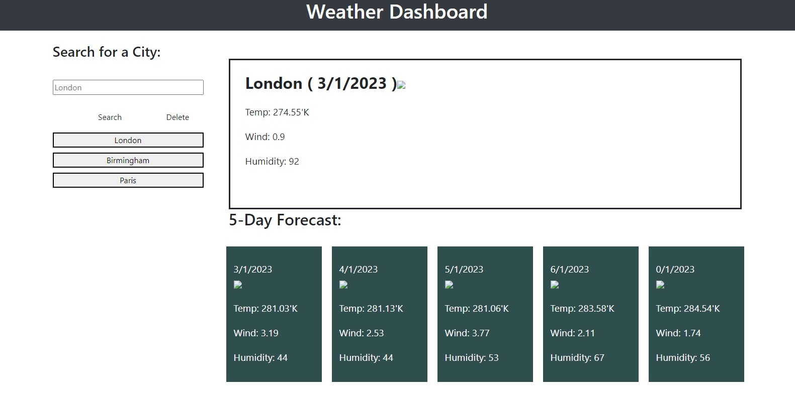

# Weather Dashboard

## Table of content
    * Usage
    * Usage
    * Contributions
    * License
    * Tests
    * undefined

## Description 
This applications display a five day weather forecast for the selected city. The application makes two calls to the openweather API. The first call retrieves the coordinates of the selected city and the second retrieves the weather infomation for the day and the forecast for the next seven days. A display of the retrieve data for London city is shown below. 

## Installation
Installation not required

## Usage

## Contributions
This project was put together by a team of four. The work was divided along the lines of JavaScript coding, Weather API integration, Quote of the day API and Project manangement. There was considerable collaboratoin by team members with each other's work. The technical support provided by the Birmingham University staff is gratefully acknowledged.

## License
For more details on the licence, please click on the link below:   
https://opensource.org/licenses/Apache2.0

## Tests 
There was extensive unit testing of the weather testing, scheduler code, Quote API and integration testing of the whole project. There was aesthetic feedback from a select group. The application was found to be functional, stable and easy to use.

## Questions
Click the link below to author profile.
https://github.com/amoham1811

User email:mohammed_wok@yahoo.co.uk  
If you have any questions you can email at the above address or visit my page on Github page using the link above.

